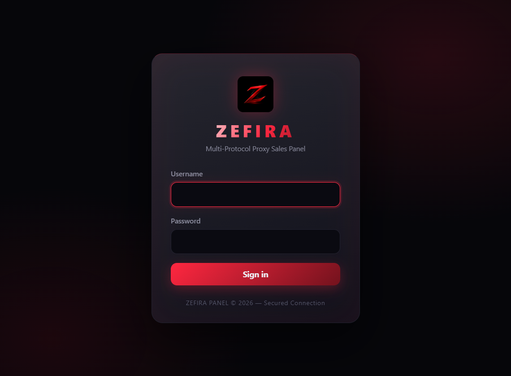
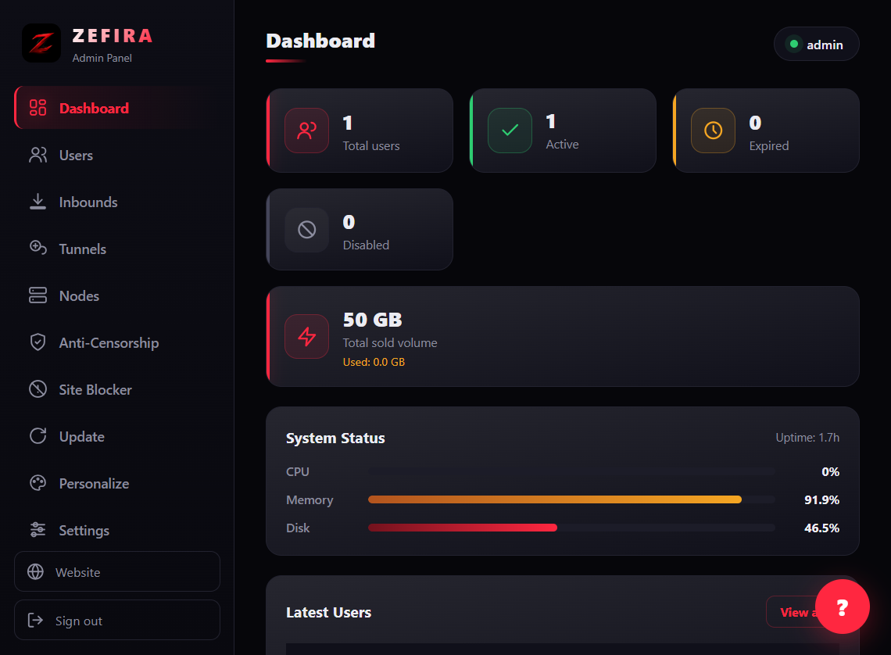
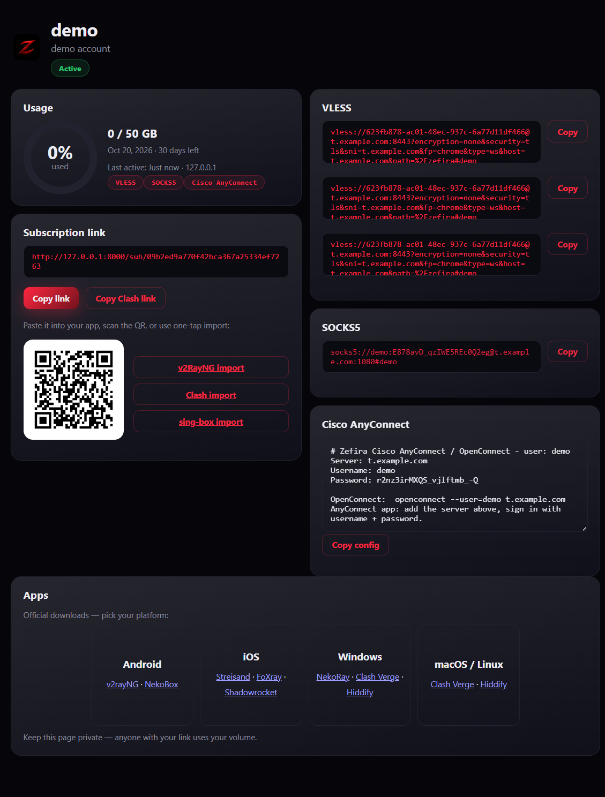
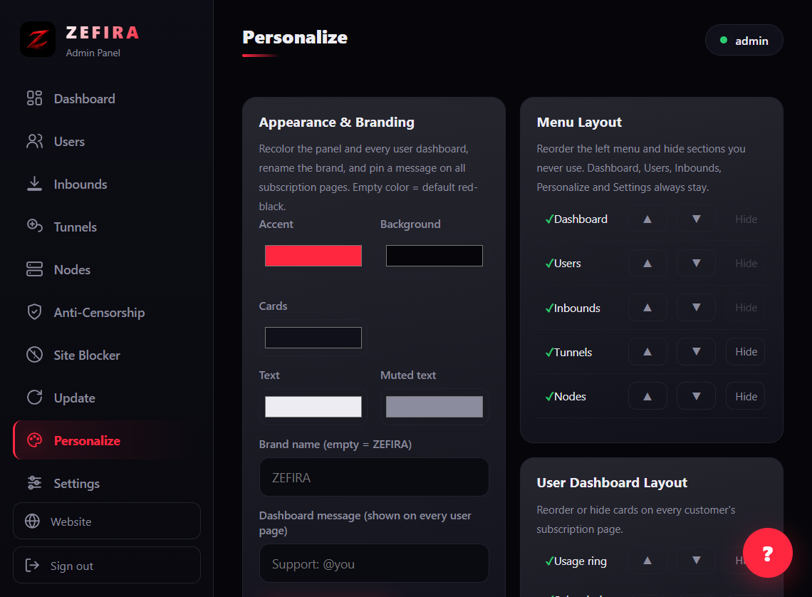

# Zefira

[](LICENSE)
[](https://mrlurix.github.io/zefira-panel/)
[](https://github.com/mrlurix/zefira-panel/blob/main/security_test.py)

> 📚 **Documentation: [mrlurix.github.io/zefira-panel](https://mrlurix.github.io/zefira-panel/)** — install guide, user manual, API reference, FAQ.

Simple panel for managing and selling VPN accounts. Started as a private tool for my own servers and cleaned up for public use.

Works with VLESS, VLESS-REALITY, VMess, Trojan, Shadowsocks, Hysteria2, WireGuard, OpenVPN, L2TP/IPsec, Cisco AnyConnect and SOCKS5. One user can have multiple protocols at once and gets a single subscription link.

Built with FastAPI + SQLite. No Docker required, just Python.

### Screenshots






### Install on a server (one line)

```bash
bash <(curl -fsSL https://raw.githubusercontent.com/mrlurix/zefira-panel/main/install.sh)
```

The script installs Python deps, creates a systemd service and prints your login URL + password. Works on Ubuntu / Debian / Alma / Rocky.

To remove later: `sudo bash install.sh --uninstall`

### Manual install

```bash
git clone https://github.com/mrlurix/zefira-panel.git
cd zefira-panel
python3 -m venv .venv
source .venv/bin/activate
pip install -r requirements.txt
python -m uvicorn main:app --host 0.0.0.0 --port 8000 --no-server-header --no-proxy-headers
```

First run prints the admin username/password in the terminal. If you set `ZEFIRA_ADMIN_PASSWORD` before starting, it will use that instead.

Default login: `http://YOUR_SERVER_IP:8000`

### What you get

- Users with traffic limit, expiry date, and notes. Start-on-first-use is supported if you want the timer to start only after the first connection. Pencil button per row edits note, volume, expiry, device limit.
- Multiple protocols per user, all in one subscription. Supports normal base64 subs and Clash YAML (`?format=clash`). Link remarks show the plain username.
- Browser dashboard: opening a subscription link in a browser shows usage, links, QR and apps; VPN clients always get raw bytes.
- Inbounds: define extra ports/hosts per protocol and every user gets links for all of them. Pin inbounds to server nodes — offline nodes are auto-excluded from links.
- Server nodes: register remote servers with 5-minute health checks, latency and uptime; on-demand check, enable/disable, safe delete.
- Anti-censorship: generate REALITY keys inside the panel, links use `xtls-rprx-vision` and rotate SNI automatically.
- BackPack tunnel nodes: create tunnels for your Iran/Kharej servers, download the setup guide with the token already filled in, and check if the Iran side is reachable.
- QR codes for every subscription, ZIP download for configs.
- AI assistant bubble: panel-only helper (OpenAI/Anthropic/Gemini/Ollama) for beginners.
- One-click updates from GitHub with changelog preview, right inside the panel.
- API tokens (`zfp_…` bearer) for Telegram bots and dashboards — no CSRF header needed. Scopes: `full` or least-privilege `bot` (list/create users only).
- Full personalization: theme colors, brand name, dashboard message.
- Strong password gate on sensitive actions, full audit log, system stats, Telegram notifications if you want.
- JSON backup / restore (both password confirmed), optional encrypted backups. Also imports/exports all settings.
- Runs as an unprivileged `zefira` systemd user (never root); volume quota enforced on subscriptions.

Full guides live on the docs site (link at the top).

### Settings you might want to change

Most things are in the panel itself: **Settings -> Server / Hosts Settings** (domain, ports, DNS, REALITY settings) and **Settings -> Remote Access** (public URL, trusted proxies).

If you prefer env files, copy `.env.example` to `.env`. Env vars are only used as defaults on first start.

### Security

I tried to keep it tight: scrypt for passwords, JWT in HttpOnly cookies, rate limits on login, CSRF checks, strict CSP, parameterized queries, no innerHTML for user data, encrypted secrets at rest, and audit logging. 

There is a test suite with 117 checks that hits the running panel from the outside:

```bash
python security_test.py http://127.0.0.1:8000 admin YOURPASS
```

It should print `117/117 checks passed` or similar - if not, open an issue.

### API

It's a normal REST API, all under `/api/*`. Check the Docs page in the panel for the full table, or just open browser devtools while using the panel.

### License

MIT - see [LICENSE](LICENSE). Do what you want, just keep the notice.

### Donation

If Zefira helps you, consider supporting it: full details (wallets + contact) on the [donate page](https://mrlurix.github.io/zefira-panel/donate.html).

```text
TRX (BEP-20):   0x4caF4EfDe83784351ED81e39f56e5dB49FE8FE18
ETH (BEP-20):   0x4caF4EfDe83784351ED81e39f56e5dB49FE8FE18
SOL (BEP-20):   0x4caF4EfDe83784351ED81e39f56e5dB49FE8FE18
```

---

If you like it, give it a star. Issues and PRs are welcome.
