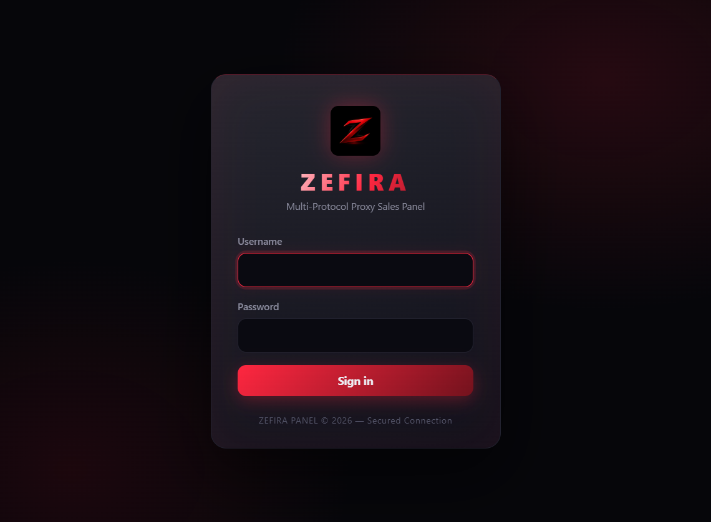
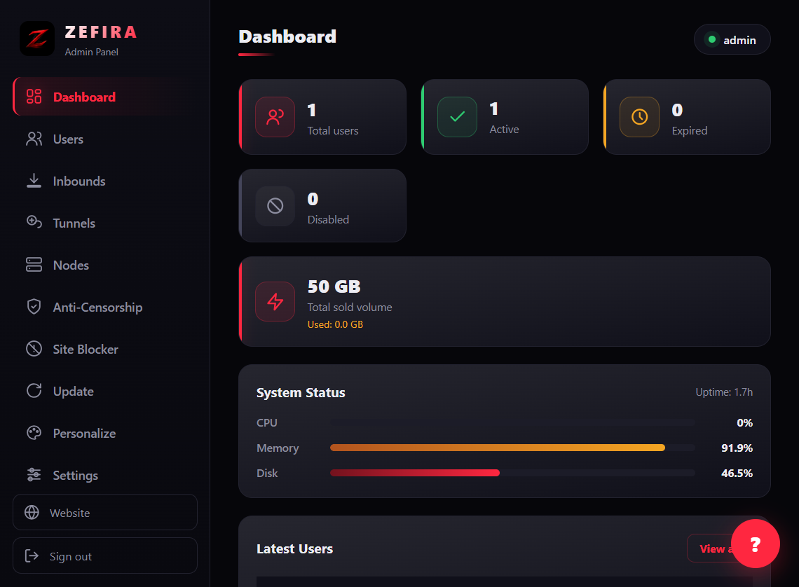
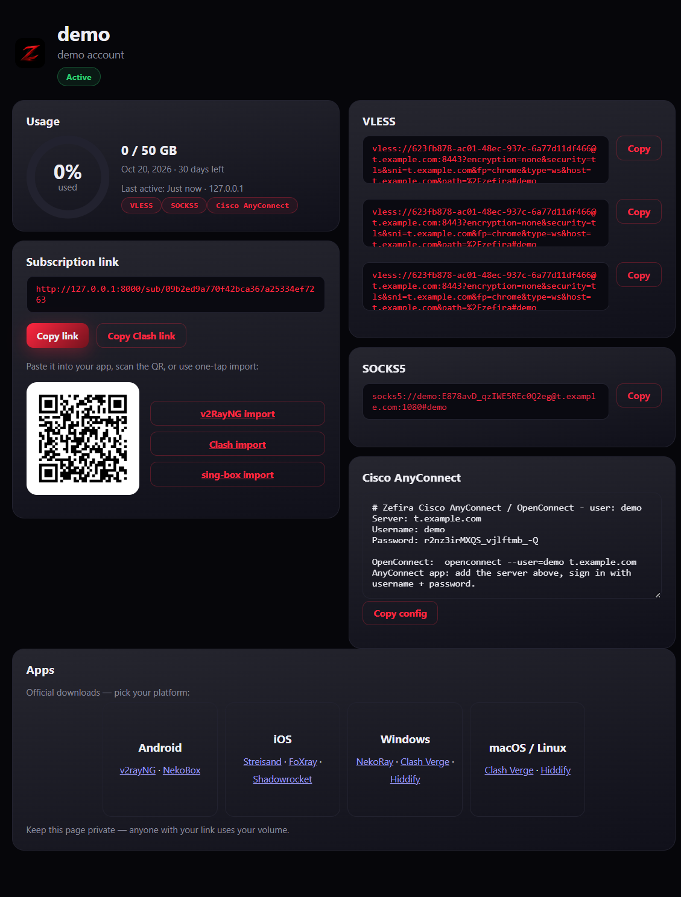
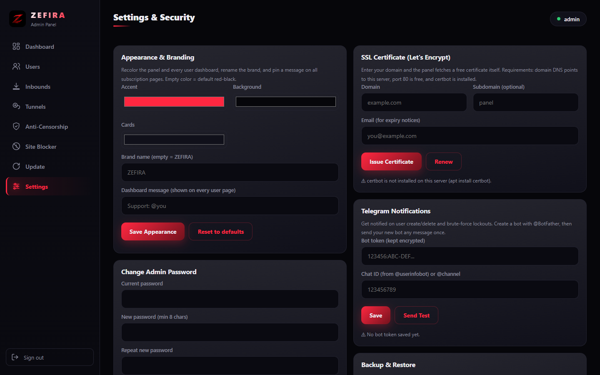

# Zefira

[](LICENSE)
[](https://mrlurix.github.io/zefira-panel/)
[](https://github.com/mrlurix/zefira-panel/blob/main/attack_test.py)

> 🌐 **Языки:** [English](README.md) · [فارسی](README.fa.md) · [中文](README.zh.md) · **Русский**

> 📚 **Документация: [mrlurix.github.io/zefira-panel](https://mrlurix.github.io/zefira-panel/)** — руководство по установке, руководство пользователя, справочник API, частые вопросы.

Простая панель для управления и продажи VPN-аккаунтов. Начиналась как личный инструмент для моих серверов, затем была приведена в вид, пригодный для публичного использования.

Работает с VLESS, VLESS-REALITY, VMess, Trojan, Shadowsocks, Hysteria2, WireGuard, OpenVPN, L2TP/IPsec, Cisco AnyConnect и SOCKS5. Один пользователь может иметь сразу несколько протоколов и получает **одну** ссылку подписки.

Сделано на FastAPI + SQLite. Docker не нужен, достаточно Python.

### Скриншоты






### Установка на сервер

Одной командой:

```bash
curl -fsSL https://raw.githubusercontent.com/mrlurix/zefira-panel/main/install.sh | sudo bash
```

Предпочитаете сначала прочитать? Скачайте, посмотрите, и запустите **именно эту** копию:

```bash
d="$(mktemp -d)"                       # приватный каталог, читаемый только вами
curl -fsSL -o "$d/install.sh" \
  https://raw.githubusercontent.com/mrlurix/zefira-panel/v1.15.16/install.sh
less "$d/install.sh"
sudo bash "$d/install.sh"
rm -rf "$d"
```

> Оба способа работают. Однострочный вариант передаёт всё, что upstream отдаёт в этот момент, прямо в корневую оболочку, поэтому если вам важно, **какой** код выполняется от root, используйте второй: он попадает в каталог, который `mktemp` только что создал для вас (фиксированный `/tmp/zefira-inst` мог быть заранее создан другим локальным пользователем, а `mkdir -p` молча succeeds на каталоге, которым он не владеет), а тег `v1.15.16` фиксирует сам установщик.
>
> Затем установщик клонирует исходники панели по тегу релиза, который идёт с ним. Если нужно жёстче — указать точный коммит:
>
> ```bash
> ZEFIRA_EXPECTED_SHA=<коммит из 40 символов> sudo bash install.sh
> ```
>
> Отклоняется, если клон не этот коммит. `ZEFIRA_INSTALL_REF=main` возвращает прежнее поведение «следить за веткой». Установщик также отказывается использовать сам `/opt/zefira` как источник: это дерево доступно служебной учётной записи, и доверие к нему передало бы служебный плацдарм root'у.

Скрипт ставит зависимости Python, создаёт службу systemd и сохраняет учётные данные первого входа в `instance/first-run-credentials.txt` (права 600) — прочитайте через `sudo cat` и удалите после первого входа. Работает на Ubuntu / Debian / Alma / Rocky (нужен Python 3.10+).

С включённой опцией nginx панель слушает только `127.0.0.1`, и файрвол открывает лишь 80/443; без неё панель отвечает обычным HTTP на выбранном порту, поэтому поставьте TLS перед ней, прежде чем заводить реальные аккаунты.

Удаление: `sudo bash install.sh --uninstall`

### Ручная установка

```bash
git clone https://github.com/mrlurix/zefira-panel.git
cd zefira-panel
python3 -m venv .venv
source .venv/bin/activate
pip install -r requirements.txt
python -m uvicorn main:app --host 127.0.0.1 --port 8000 --no-server-header --no-proxy-headers
```

Слушайте на `127.0.0.1` и поставьте перед ним обратный прокси с TLS. `--host 0.0.0.0` публикует вход администратора открытым текстом (без Secure cookie, без HSTS).

Первый запуск записывает имя пользователя и пароль администратора в `instance/first-run-credentials.txt` (права 600) и печатает только путь. Если до старта задан `ZEFIRA_ADMIN_PASSWORD`, используется он.

> **Запускайте ровно один worker.** Ограничители частоты, блокировки restore/update, цикл мониторинга узлов и кэш настроек живут в памяти процесса — `--workers N` умножает бюджеты ограничения частоты и может перемежать restore'ы. Масштабируйтесь машинами, а не worker'ами.

Вход по умолчанию: `http://YOUR_SERVER_IP:8000`

### Что вы получаете

- Пользователи с лимитом трафика, сроком действия и заметками. Поддерживается start-on-first-use, если хотите, чтобы отсчёт начинался только после первого подключения. Карандаш в каждой строке редактирует заметку, объём, срок и лимит устройств.
- Несколько протоколов на пользователя, все в одной подписке. Поддерживаются обычные base64-подписки и Clash YAML (`?format=clash`). В имени ссылки показывается простой логин.
- **Лента подписки несёт только share-ссылки и ничего больше.** `WireGuard`, `OpenVPN`, `L2TP/IPsec` и `Cisco AnyConnect` — файловые протоколы: `.conf`/`.ovpn` не является URI, поэтому никакой импортёр ссылок его не прочитает, — и они выдаются файлами: карточка на панели, кнопка **Download config** у пользователя или ZIP. Поэтому тариф, состоящий *только* из файловых протоколов, нечего перечислять, и лента отвечает `422` с этим объяснением вместо страницы текста, который клиент разобрать не может. До v1.15.8 эти файлы встраивались в ленту под заголовком `### OpenVPN ###`; клиент пропускал ровно одну строку, начинающуюся с `#`, а остальные ~90 получал как узлы.
- Панель в браузере: открытая в браузере ссылка подписки показывает расход трафика, ссылки, QR и приложения; VPN-клиенты всегда получают сырые байты.
- Inbounds: задавайте дополнительные порты/хосты для каждого протокола, и каждый пользователь получит ссылки на все них. Inbounds можно закрепить за серверными узлами — офлайн-узлы автоматически исключаются из ссылок.
- Серверные узлы: регистрируйте удалённые серверы с проверкой здоровья раз в 5 минут, задержкой и аптаймом; проверка по требованию, включение/отключение, безопасное удаление.
- Обход цензуры: ключи REALITY генерируются внутри панели, ссылки используют `xtls-rprx-vision` и автоматически ротируют SNI.
- Туннельные узлы BackPack: создавайте туннели для серверов в Иране/за рубежом, скачивайте руководство с уже подставленным токеном и проверяйте доступность иранской стороны.
- QR-код для каждой подписки, скачивание конфигов в ZIP.
- Пузырь ИИ-ассистента: помощник только внутри панели (сначала Groq, также OpenAI/Anthropic/Gemini/Ollama) для новичков.
- Обновление в один клик из GitHub с предпросмотром changelog прямо в панели.
- API-токены (`zfp_…` bearer) для Telegram-ботов и дашбордов — заголовок CSRF не нужен. Scope: `full` или минимально привилегированный `bot` (только список/создание пользователей).
- Полная персонализация: цвета темы, название бренда, сообщение на панели.
- Сильный пароль на чувствительных действиях, полный журнал аудита, статистика системы, уведомления в Telegram по желанию.
- Резервное копирование и восстановление в JSON (оба с подтверждением паролем), опционально зашифрованные бэкапы. Также импорт и экспорт всех настроек.
- Работает как непривилегированный системный пользователь `zefira` (никогда root); квота трафика применяется к подпискам.

Полные руководства — на сайте документации (ссылка вверху).

### Настройки, которые стоит поменять

Большее есть в самой панели: **Settings -> Server / Hosts Settings** (домен, порты, DNS, настройки REALITY) и **Settings -> Remote Access** (публичный URL, доверенные прокси).

Если предпочитаете env-файлы, скопируйте `.env.example` в `.env`. Переменные окружения используются только как значения по умолчанию при первом запуске.

### Безопасность

Я старался держать её жёстко: scrypt для паролей, JWT в HttpOnly-куках, ограничение частоты входа (по исходному IP, проверяется до любого хеширования), проверка CSRF, строгий CSP, параметризованные запросы, никакого innerHTML для пользовательских данных и журнал аудита.

**Что зашифровано:** учётные данные Telegram/AI, ключи хостов REALITY и WireGuard, токены туннелей и зашифрованные бэкапы (AES/Fernet с `instance/secret.key`). **Что не зашифровано:** учётные данные VPN каждого клиента в базе (`secret_data`) — это обычный JSON в `instance/zefira.db` и в незашифрованном бэкапе, намеренно, чтобы панель могла перестраивать ссылки без цикла расшифровки. Относитесь к базе и незашифрованным бэкапам как к учётным данным клиентов: держите `instance/` на `700`, используйте зашифрованные бэкапы или полнодисковое шифрование и прочитайте [SECURITY.md](SECURITY.md).

### Запуск тестов

Эти наборы бьют по работающей панели снаружи. Запустите панель, затем выполняйте их по одному (перезапуская панель между наборами). Либо все сразу: `python run_all_tests.py admin YOURPASS`. Наборы не зависят от порядка и в конце возвращают панель к заводским настройкам.

**Онлайн-наборы (9)** — требуют работающей панели:

```bash
python security_test.py      http://127.0.0.1:8000 admin YOURPASS  # злоупотребления/защита
python functional_test.py    http://127.0.0.1:8000 admin YOURPASS  # сквозные сценарии
python feature_test.py       http://127.0.0.1:8000 admin YOURPASS  # покрытие возможностей
python attack_test.py        http://127.0.0.1:8000 admin YOURPASS  # живые атаки
python attack_quota_test.py  http://127.0.0.1:8000 admin YOURPASS  # границы квот/схемы
python attack_paths_test.py  http://127.0.0.1:8000 admin YOURPASS  # пути оператора
python frontend_bugs_test.py http://127.0.0.1:8000 admin YOURPASS  # регрессии фронтенда
python panel_sections_test.py http://127.0.0.1:8000 admin YOURPASS  # разделы панели
python security_audit_test.py http://127.0.0.1:8000 admin YOURPASS  # аудит безопасности
```

`feature_test.py` обходит все 77 маршрутов API в 11 разделах панели и утверждает, что каждая возможность **действительно работает** (реальные ссылки в подписке, декодируемый QR, рабочий архив конфигов, матрица scope бота, циклы бэкап/восстановление…), а не просто доступна. `attack_test.py` сам выпускает враждебный трафик: подмена заголовков, сохранённый XSS, обход пути, чрезмерно большие и глубоко вложенные тела, трюки с Unicode/кодировкой, timing oracle, лавина входов, попытки вытеснить ограничитель и полная матрица аутентификации.

**Без сервера (9 наборов на Python)** — выполняют поставляемый код, а не читают его, потому что каждый дефект ниже прошёл ревью на уровне исходников:

```bash
python installer_test.py          # гарантии установщика, статическими проверками
python dashboard_link_test.py     # ссылка панели клиента при установке с угаданным доменом
python proxy_trust_test.py        # доверие прокси и согласованность client IP
python link_encoding_test.py      # кодирование имени в share-ссылке
python update_guard_test.py       # защита обновления от подмены runtime-состояния
python migration_guard_test.py    # шаги миграции схемы, каждый в своей транзакции
python env_symlink_guard_test.py  # запись .env установщиком через симлинк
python bump_assets_guard_test.py  # входные данные обновления версии ресурсов
python i18n_test.py               # шаблоны и JS панели против всех локалей
python docs_coverage_test.py      # каждый эндпоинт, раздел и настройка задокументированы
```

**Без сервера (2 скрипта Node)** — для четырёх языков сайта документации:

```bash
node i18n_dict_check.js           # словари документации, загруженные и проверенные
node i18n_render_check.js         # рендерер документации с враждебными строками
```

`i18n_dict_check.js` существует потому, что документация на четырёх языках должна оставаться согласованной, а проверял это никто. Он загружает `docs/assets/i18n.js`, читает тот объект, который получит браузер, и падает при ключе, отсутствующем или пустом в каком-либо языке, при значении, в котором склеились две записи, при мусорной кодировке, при `data-i18n`, написанном не так, как его читает `applyI18n`, и при странице, ссылающейся на ключ, которого нет ни в одном языке. О **совпадающих с английским** значениях он сообщает, но не падает, потому что это иногда верно: `GitHub Security Advisories` — собственное название функции GitHub.

После правки чего-либо под `docs/` запустите `python docs/build_index.py`. Она перестраивает индекс поиска, даёт каждому заголовку устойчивый якорь и **сама** поднимает счётчик сброса кэша через `docs/bump_assets.py`. Последнее не косметика: счётчик живёт в четырнадцати местах, и если поднять его только на двенадцати страницах, `docs.js` и `support-ai.js` продолжат запрашивать **предыдущие** `search-index.json` и `site-knowledge.json` — свежий HTML, устаревшие результаты поиска и бот поддержки, отвечающий по базе знаний прошлой недели.

Количество проверок в каждом наборе **намеренно не** указано: оно меняется с каждой новой проверкой, а устаревшее число хуже отсутствия числа, потому что выглядит как то, с чем можно сравнивать. Читайте его из самого прогона — каждый набор печатает `N/N checks passed`.

### Зависимости

`requirements.txt` хранит поддерживаемые вручную **прямые** закрепления (то, что вы обновляете намеренно). `requirements.lock` — полностью разрешённый и **закреплённый по хешам** набор, который на самом деле устанавливают `install.sh` и обновление внутри панели:

```bash
pip install --require-hashes --no-deps -r requirements.lock
```

Точные закрепления верхнего уровня никогда не закрепляли транзитивный граф: один только `uvicorn[standard]` тянет дюжину диапазонов версий, поэтому две установки одного и того же `requirements.txt` могли выполнить разный код. После правки `requirements.txt` пересоберите закрепление, затем проверьте его:

```bash
python tools_lock.py
python verify_lock_hashes.py
```

> **Всегда запускайте проверку.** Закрепление собирается на одной машине и ставится на другой, а хеш, покрывающий только платформу машины-сборщика, обрывает установку на сервере — или, что хуже, оставляет закрепление, которое ничего не проверяет. Более ранняя версия `tools_lock.py` записывала только те артефакты, которые могла скачать локально, из-за чего 11 из 31 пакетов не устанавливались на Linux. `verify_lock_hashes.py` сверяет каждый записанный хеш с PyPI.

### API

Это обычный REST API, всё под `/api/*`. Полную таблицу смотрите на странице Docs внутри панели или откройте инструменты разработчика браузера, работая с панелью.

### Лицензия

MIT — см. [LICENSE](LICENSE). Делайте что хотите, только сохраните уведомление.

### Пожертвование

Если Zefira вам помогает, можно его поддержать: адреса кошельков на [странице пожертвований](https://mrlurix.github.io/zefira-panel/donate.html).

```text
TRX BEP-20:    0x4caF4EfDe83784351ED81e39f56e5dB49FE8FE18
ETH BEP-20:    0x4caF4EfDe83784351ED81e39f56e5dB49FE8FE18
USDC BEP-20:   0x4caF4EfDe83784351ED81e39f56e5dB49FE8FE18
```

---

Если понравилось, поставьте звезду. Issue и PR приветствуются.

[English](README.md) · [فارسی](README.fa.md) · [中文](README.zh.md) · **Русский**